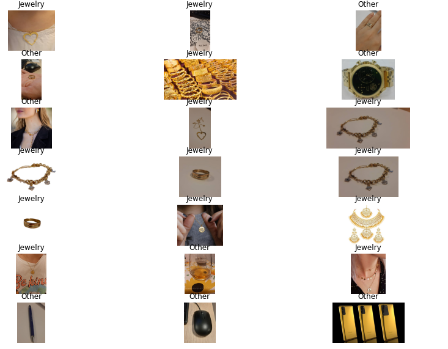

# Jewelry recognizer

Jewelry recognizer is an API built by [Flask](https://flask.palletsprojects.com/en/2.0.x/). The API utilizes deep learning convolutional model, which distinguishes the jewelry from all other products. Compared to other trained models for jewelry, our jewelry recognizer can detect jewelry on hands, colorful surfaces, neck, etc. To train the model, we used Transfer learning using Mobile-Net and Inception -v3 networks, which were trained by [Imagenet](https://www.image-net.org/) dataset. Our chosen model for our API is Mobile-Net as it could give a higher accuracy of 98.12% based on the experimental results.

Note: Some of the images that we used to enrich our jewelry-image dataset were obtained from [here](https://github.com/princesegzy01/Jewellery-Classification)

# Notebooks

You can find the notebooks in the root. The notebooks include the implementation of the models.

- Transfer Learning-Inception V3.ipynb (Transfer Learning using Inception V3)

- Transfer Learning-MobileNet.ipynb (Transfer Learning using Mobile-Net)

# Installation

## Virtual Environment 
For installing the API in your machine if you wish to rely on just python machine, please follow these following steps:

- 1.clone the last version of the program
- 2.First make sure that you are at "ai-api-env" directory 
- 3.Open command prompt: make sure that you already have python 3.8 installed on your computer. It was checked with this version of the python.
- 4.install virtualenv by this code:>> pip install virtualenv
- 5.run >>virtualenv .
### To run the virtual environment, run the following command
- 6.run >>.\scripts\activate on windows or source bin/activate on (linux)
- 7.run >> pip install -r requirements.txt

Now all the dependencies were installed on your machine. You can run API by the following command. Note that each time you want to run API, you should activate the virtual environment as step 6, and you should be at "ai-api-env" directory 
- 8.run >>python ai-api

Now ai-api is listening. Notice that config file includes the host and port, which were set "127.0.0.1" and 50. If you wish to change them, just change the config file accordingly.

Once ai-api receives a binary file of image (byte like-object file) by a post command "predic", it will responds to the request as either "jewelry" or "other". In following, you see an example of request using nodejs given host="127.0.0.1" and port:50:

Also note that, once you installed all packages, since some packages are heavy, do not forget to put "Scripts" and "Lib" in the .gitignore in order to push ai-api onto your repository.

## Docker 
For installing API in your machine if you wish to use docker, please follow these following steps:

- 1.clone the last version of the program
- 2.First make sure that you are at "ai-api-env" directory 
- 3.unzip source.rar
- 4.cd .. go to "ai-pi-dockernized"
- 5-docker build -t ai-api_dockerniezed
- 6-docker run -d -p 8080:8080 ai-api_dockerniezed

Then just run the image in the docker. Notice that host="0.0.0.0" and port=5050 are fixed for docker version. 

Just one more thing, to test the api, you can download and install POSTMAN software (desktop version) that is meant for checking apis. To send a request, just choose body, then binary, and upload your Image. In the url section, choose post and enter http://127.0.0.1:50/predict. At the end, pres send. See the result.

Good luck and enjoy AI power. 

Nima Farnoodian and Atefeh Bahrami.
## An example of sending request to the API using NodeJS:
````
var request = require('request');
var options = {
  'method': 'POST',
  'url': 'http://127.0.0.1:50/predict',
  'headers': {
    'Content-Type': 'image/png'
  },
  body: "<file contents here-byte file>"
};
request(options, function (error, response) {
  if (error) throw new Error(error);
  console.log(response.body);
});
````

